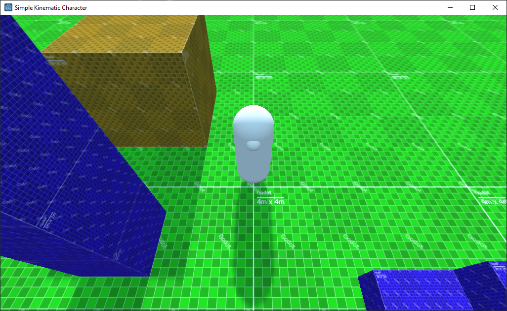

Simple kinematic character for Godot
====================================

This sample project attempts to implement a very simple 3D character that moves horizontally based on keyboard or d-pad input.

It's designed to just collide with objects and use raycasts to stay on the ground.

License
-------
Released under MIT license, see LICENCE

Textures were created with: https://wahooney.itch.io/texture-grid-generator
BIG shoutout to wahooney
